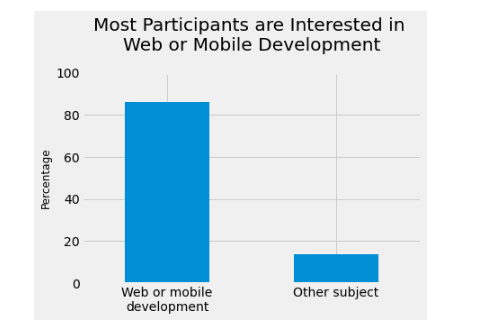
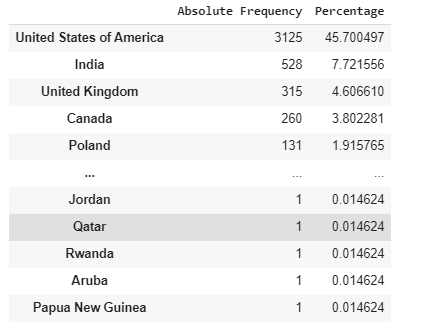

# Finding-Best-Markets-To-Advertise-in
A marketing research approach based on data analysis to get insights about the best customer segments to target

## Introduction

Through this project, we will implement the first three stages of the CRISP-DM approch on the FreeCodeCamp survey conducted on more than 20,000 developers.
Assuming that we are an E-learning platform and our main problem is to find the best market to advertise our courses in.
The main questions we want to answer are:
•	what are the different industries developers are interested in?
•	What are the locations with the greatest number of new developers?
•	How much money new coders are willing to spend on learning.

## Output

 

## Packages used

Numpy
Pandas
Matplotlib
Seaborn

## Data
 
All data details can be found through this <a href = 'https://github.com/freeCodeCamp/2017-new-coder-survey/' >link</a>